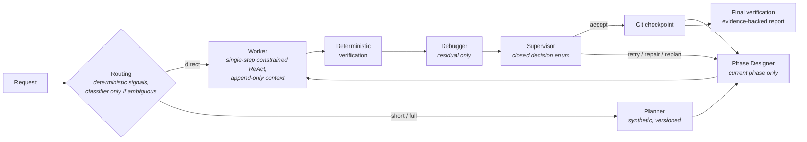

<div align="center">

# 🔴 Red Giant

**A verification-first agentic system that makes *tiny* local language models<br>reliably useful on non-prosumer hardware.**

[](memory/plan_red_giant.md)
[](pyproject.toml)
[](https://huggingface.co/unsloth/gemma-4-E2B-it-qat-GGUF)
[-555555)](docker/severino-sim/compose.yml)
[](#-target-hardware-severino)
[](#-key-technical-decisions)

*The model stays small. The **system** becomes large.*

[Thesis](#-the-thesis) · [Decisions](#-key-technical-decisions) · [Findings](#-empirical-findings-so-far-phase-0) · [Pipeline](#-pipeline-at-a-glance) · [Hardware](#-target-hardware-severino) · [Roadmap](#-roadmap) · [Docs](#-repository-map) · [Quickstart](#-getting-started-development-windows)

</div>

---

Red Giant wraps a **~2B-effective-parameter model** — Gemma 4 E2B, Q4 QAT, GGUF, CPU-only — in a deterministic pipeline of **decomposition, continuous verification, minimal context, and KV-cache-aware prompt engineering**.

> Most agentic projects chase the biggest model they can reach. Red Giant goes the opposite way: the smallest usable model, on the kind of machine a non-prosumer actually owns — a 15W mini-PC with 4 CPU cores and no usable GPU. Anyone can build agents on a workstation-class GPU box; the interesting problem is closing the gap between local inference on consumer hardware and the inevitable scarcity of that scenario.

**Status:** early development — Phase 0 (foundations & baseline measurements) in progress. This README is refreshed at the end of every development phase.

## 🧠 The thesis

Small language models don't fail because they lack intelligence for a single step; they fail from *breadth*: tasks too wide, contexts too long, ambiguous instructions, unverified claims of success, errors compounding across steps. Red Giant doesn't try to make the model smarter — it systematically removes the conditions under which small models fail:

| # | Principle | In practice |
|---|---|---|
| 1 | **Global planning, local execution** | A synthetic, versioned plan; only the current phase is expanded; only one subtask runs at a time |
| 2 | **Continuous verification** | Deterministic oracles first (tests, compilers, linters, exit codes, citation matching); a model-based verifier only where no mechanical oracle exists. Subtasks are *designed* to be mechanically verifiable |
| 3 | **Minimal context** | Each role receives the least sufficient context (~4–8K tokens per call), never the full history |
| 4 | **Deterministic orchestration** | *The model proposes; the orchestrator decides.* Every state mutation is typed, attributed, persisted (SQLite). No success without recorded evidence |

## ⚙️ Key technical decisions

| Decision | Rationale |
|---|---|
| 🐜 **Model: Gemma 4 E2B** (QAT, UD-Q4_K_XL GGUF) — the smallest, on purpose | Every measured improvement is attributable to the architecture, not model scale. E4B exists only as an evaluation reference |
| 📌 **Runtime: llama.cpp `llama-server`, version-pinned** (container digest = the reference) | Direct access to grammar-constrained decoding, KV-cache control (`cache_prompt`, slots, `--slot-save-path`), separate prefill/generation timings |
| 🔒 **Grammar-constrained decoding on every structured output** (JSON Schema → GBNF) | The sampler *cannot* produce malformed output: that failure class is eliminated by construction. Measured overhead: 0.4–10% |
| 🧩 **JSON-only runtime; one small Pydantic schema per role; closed enums** | A 2B model fills 8 constrained fields well and 40 free-text fields badly. Schemas double as the grammar contract |
| ♻️ **Stable prompt prefixes (S1→S7 layout), append-only agent loop** | llama.cpp reuses KV cache only for byte-identical prefixes. Prefill is the dominant cost on CPU — prefill engineering is a first-class goal of the project |
| 🚦 **Strictly sequential, batch-style execution; one inference at a time** | On 4 shared cores, concurrent inference is self-sabotage. Tasks are async jobs (launch, close the page, come back), not a chat |
| ⚖️ **Every cognitive role must earn its place** (A/B in a built-in evaluator) | Guards against governance overhead exceeding useful work. Guiding metric: **useful tokens / total tokens**. A role that doesn't pay for itself is removed |
| 📉 **Official metrics are CPU-only, on resource-capped profiles** | A dev GPU hides every token-economy problem. The reference profile is a Docker container capped to target-equivalent resources |
| 🚫 **No external LLM APIs, ever** | A system that escapes to a big model under pressure proves nothing. Honest explicit failure is a valid result |
| 🪶 **Stack: Python · FastAPI + HTMX + Jinja2 · SQLite · zero frontend build** | One process, one port, deployable as one container next to llama-server |

## 🔬 Empirical findings so far (Phase 0)

Field notes from probing grammar-constrained decoding on Gemma 4 E2B — useful to anyone building on small models:

1. **The grammar constrains, but does not inform.** With guided decoding active but the schema absent from the prompt, the model produces structurally valid JSON filled with literal placeholders (`"..."`, `"$id"`). The schema must be shown *in the prompt*; the grammar only guarantees shape.
2. **Instruction-tuned models need their chat template even for raw completions.** Without Gemma's turn markers, output degenerates.
3. **The grammar guarantees shape only within the generation budget.** Output truncated at `n_predict` is broken JSON *despite* the grammar. Stop reason `limit` must be treated as an explicit error, and per-role token budgets sized with headroom. Compact JSON (no pretty-printing) saves 20–30% of output tokens.

With those three fixed: **60/60 structurally valid, 60/60 semantically filled outputs** across decision / plan / subtask-design schemas, at near-zero grammar overhead on large payloads. Full report: [`bench/results/f0_constrained_decoding.md`](bench/results/f0_constrained_decoding.md).

## 🔁 Pipeline at a glance



**Domains:** coding (verified by tests) · local research & web research (verified by mechanical citation checking and multi-source triangulation) · advice (explicit, logged choice between web-first and declared model-knowledge). *Not a coding assistant* — the same pipeline serves all four.

## 🖥️ Target hardware ("Severino")

| | |
|---|---|
| **Machine** | BOSGAME E5 mini-PC home server |
| **CPU** | AMD Ryzen 3 5300U (Zen 2, 4C/8T, 15W) — **4 cores allocated** to Red Giant + llama-server |
| **GPU** | none usable (iGPU Vega: no ROCm, Vulkan marginal) → **CPU-only inference** |
| **RAM** | 32 GB dual-channel (at MVP time), ~10 GB budget |
| **Constraint** | the rest of a full homelab stack keeps running on the same box |

Development happens on a fast workstation, but **official numbers only come from CPU-capped profiles** (`severino-sim`: Docker, 2 workstation cores ≈ 4 target cores, 10 GB) and from the real box.

## 🗺️ Roadmap

- [x] **F0 — Foundations** *(in progress)*: pinned runtime, model verification, constrained-decoding probe, resource-capped simulator, baseline benchmarks
- [ ] **F1 — Deterministic core + worker**: walking skeleton, evaluator with synthetic tasks
- [ ] **F2 — Minimal web GUI**: async job queue, live execution tree, approval/clarification queue
- [ ] **F3 — Planning**: planner + phase designer, dynamic versioned plans, replanning
- [ ] **F4 — Continuous verification**: two-stage debugger, supervisor, anti-loop, git checkpoints/rollback
- [ ] **F5 — Context & KV-cache engineering**: prefix reuse, slot save/restore, verified state compression
- [ ] **F6 — Adaptive routing**: classifier/assessor, direct/short/full pipelines, calibration
- [ ] **F7 — Non-coding domains**: local/web research with verified citations, advice
- [ ] **F8 — Real-world benchmark + deployment**: a Laravel 13 chatbot codebase, deployed on the target box

## 📚 Repository map

| Document | Purpose |
|---|---|
| [`memory/small-model-powerhouse-specsheet.md`](memory/small-model-powerhouse-specsheet.md) | Vision & requirements (the operating spec) |
| [`memory/plan_red_giant.md`](memory/plan_red_giant.md) | The implementation **contract**: 21 binding decisions, full architecture (DB DDL, config, tool catalog, prompt layout), 9 phases with real signatures, per-subphase rationale and acceptance criteria. Self-sufficient by design |
| [`memory/codebase_reference.md`](memory/codebase_reference.md) | The codebase atlas — every real class/signature/table/endpoint, mechanically verified against the code by `scripts/check_reference.py` (build-blocking) |
| [`bench/results/`](bench/results/) | Committed measurement reports (constrained-decoding probe, CPU baselines) |

## 🚀 Getting started (development, Windows)

```powershell
py -3.12 -m venv .venv
.venv\Scripts\Activate.ps1
pip install -e ".[dev]"

scripts\download-llama.ps1     # pinned llama.cpp binaries (CUDA + CPU)
scripts\download-model.ps1     # Gemma 4 E2B QAT Q4 GGUF, SHA256-verified
scripts\start-llama.ps1 -Profile dev-fast                 # GPU server for code iteration
docker compose -f docker\severino-sim\compose.yml up -d   # the honest 2-core profile

python bench\schemas_probe.py --url http://127.0.0.1:8080   # constrained-decoding probe
python bench\run_bench.py --profile severino-sim            # CPU baseline
python scripts\check_reference.py                           # atlas ↔ code verification
```

---

<div align="center">
<sub>

**Topics:** small language models · SLM agents · local LLM · Gemma 4 E2B · llama.cpp · GGUF · grammar-constrained decoding · JSON Schema · GBNF · KV cache reuse · prefill optimization · CPU-only inference · agentic pipeline · deterministic orchestration · verification-first · home server · self-hosted AI

</sub>
</div>
