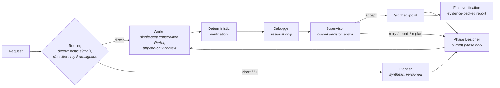

<div align="center">


**A verification-first agentic system that makes *tiny* local language models<br>reliably useful on non-prosumer hardware.**

[](memory/plan_red_giant.md)
[](pyproject.toml)
[](https://huggingface.co/unsloth/gemma-4-E2B-it-qat-GGUF)
[-555555)](docker/severino-sim/compose.yml)
[](#-target-hardware-severino)
[](#-key-technical-decisions)
[](LICENSE)

*The model stays small. The **system** becomes large.*

[Thesis](#-the-thesis) · [Niche](#-where-this-sits--the-niche-honestly) · [Decisions](#-key-technical-decisions) · [Findings](#-empirical-findings-so-far-phases-0-3) · [Pipeline](#-pipeline-at-a-glance) · [Hardware](#-target-hardware-severino) · [Roadmap](#%EF%B8%8F-roadmap--and-how-its-actually-going) · [Docs](#-repository-map) · [Quickstart](#-getting-started-development-windows)

</div>

---

Red Giant wraps a **~2B-effective-parameter model** — Gemma 4 E2B, Q4 QAT, GGUF, CPU-only — in a deterministic pipeline of **decomposition, continuous verification, minimal context, and KV-cache-aware prompt engineering**.

> Most agentic projects chase the biggest model they can reach. Red Giant goes the opposite way: the smallest usable model, on the kind of machine a non-prosumer actually owns — a 15W mini-PC with 4 CPU cores and no usable GPU. Anyone can build agents on a workstation-class GPU box; the interesting problem is closing the gap between local inference on consumer hardware and the inevitable scarcity of that scenario.

**Status:** early development — **Phase 2 complete**: a single-process web GUI (async job queue, live execution tree, consent-based approvals with standing per-file grants, budget-extension prompts, guided relaunch of failed tasks) battle-tested through 3 rounds of live user testing plus an automated 5-task battery: **15 defects found and fixed**, 4/5 task types externally verified, zero false claims in either direction. Next: Phase 3, the planner. This README is refreshed at the end of every development phase.

## 🧠 The thesis

Small language models don't fail because they lack intelligence for a single step; they fail from *breadth*: tasks too wide, contexts too long, ambiguous instructions, unverified claims of success, errors compounding across steps. Red Giant doesn't try to make the model smarter — it systematically removes the conditions under which small models fail:

| # | Principle | In practice |
|---|---|---|
| 1 | **Global planning, local execution** | A synthetic, versioned plan; only the current phase is expanded; only one subtask runs at a time |
| 2 | **Continuous verification** | Deterministic oracles first (tests, compilers, linters, exit codes, citation matching); a model-based verifier only where no mechanical oracle exists. Subtasks are *designed* to be mechanically verifiable |
| 3 | **Minimal context** | Each role receives the least sufficient context (~4–8K tokens per call), never the full history |
| 4 | **Deterministic orchestration** | *The model proposes; the orchestrator decides.* Every state mutation is typed, attributed, persisted (SQLite). No success without recorded evidence |

## 🧭 Where this sits — the niche, honestly

The local-AI landscape splits into a few well-served categories, and Red Giant deliberately is none of them:

- **Agent orchestration frameworks** give you graphs, crews and tool-calling loops — but they implicitly assume a *capable* model (a cloud API or a large local one) that can recover from its own mistakes. Point them at a 2B model on a CPU and they spiral: the retry loops, verbose prompts and long contexts they rely on are exactly what small models and slow prefill cannot afford.
- **Local inference runners** solve *running* models on your hardware — quantization, serving, chat UIs. Essential plumbing (this project builds on one of them), but they stop where the hard problem starts: a served model is not a reliable agent.
- **Structured-output libraries** solve format validity via constrained decoding. Also essential, also a component: format-valid output can still be semantically empty, truncated, or confidently wrong — this project's field notes document exactly how.
- **Research on small-model agents** increasingly says the promising recipe is small models + strict specifications + external validators. Mostly papers and surveys; few end-to-end engineered systems exist, and fewer still target genuinely constrained hardware.

**Red Giant is the intersection nobody serves**: a complete, engineered agentic *system* — not a library — purpose-built for ~2B-parameter models on watt-constrained, CPU-only consumer hardware (a 15W mini-PC, 4 cores), where token economy, KV-cache reuse, deterministic verification and human consent are the architecture, not afterthoughts. Every design decision is documented with the measurement that justifies it, and every failure mode found in the field is recorded with its technical cause.

**What it is not, equally honestly:** not a drop-in framework you `pip install` around your own model (it is opinionated end-to-end); not validated beyond small synthetic repositories yet (the real-codebase exam is a planned phase); currently calibrated on one specific model and runtime build; and not an attempt to compete with big-model agents on capability — the bet is on raising the *floor* of what trivial hardware can do reliably, not the ceiling of what intelligence can do.

If you are trying to make a small local model do real, verified work on hardware you already own — this is the problem space this repository lives in, traps and all.

## ⚙️ Key technical decisions

| Decision | Rationale |
|---|---|
| 🐜 **Model: Gemma 4 E2B** (QAT, UD-Q4_K_XL GGUF) — the smallest, on purpose | Every measured improvement is attributable to the architecture, not model scale. E4B exists only as an evaluation reference |
| 📌 **Runtime: llama.cpp `llama-server`, version-pinned** (container digest = the reference) | Direct access to grammar-constrained decoding, KV-cache control (`cache_prompt`, slots, `--slot-save-path`), separate prefill/generation timings |
| 🔒 **Grammar-constrained decoding on every structured output** (JSON Schema → GBNF) | The sampler *cannot* produce malformed output: that failure class is eliminated by construction. Measured overhead: 0.4–10% |
| 🧩 **JSON-only runtime; one small Pydantic schema per role; closed enums** | A 2B model fills 8 constrained fields well and 40 free-text fields badly. Schemas double as the grammar contract |
| ♻️ **Stable prompt prefixes (S1→S7 layout), append-only agent loop** | llama.cpp reuses KV cache only for byte-identical prefixes. Prefill is the dominant cost on CPU — prefill engineering is a first-class goal of the project |
| 🚦 **Strictly sequential, batch-style execution; one inference at a time** | On 4 shared cores, concurrent inference is self-sabotage. Tasks are async jobs (launch, close the page, come back), not a chat |
| ⚖️ **Every cognitive role must earn its place** (A/B in a built-in evaluator) | Guards against governance overhead exceeding useful work. Guiding metric: **useful tokens / total tokens**. A role that doesn't pay for itself is removed |
| 📉 **Official metrics are CPU-only, on resource-capped profiles** | A dev GPU hides every token-economy problem. The reference profile is a Docker container capped to target-equivalent resources |
| 🚫 **No external LLM APIs, ever** | A system that escapes to a big model under pressure proves nothing. Honest explicit failure is a valid result |
| 🪶 **Stack: Python · FastAPI + HTMX + Jinja2 · SQLite · zero frontend build** | One process, one port, deployable as one container next to llama-server |

## 🔬 Empirical findings so far (Phases 0-3)

Field notes from building on Gemma 4 E2B — useful to anyone working with small models. Every finding is tracked with its technical cause in the [codebase atlas, §9](memory/codebase_reference.md):

1. **The grammar constrains, but does not inform.** With guided decoding active but the schema absent from the prompt, the model produces structurally valid JSON filled with literal placeholders (`"..."`, `"$id"`). The schema must be shown *in the prompt*; the grammar only guarantees shape.
2. **Instruction-tuned models need their chat template even for raw completions.** Without Gemma's turn markers, output degenerates.
3. **The grammar guarantees shape only within the generation budget.** Output truncated at `n_predict` is broken JSON *despite* the grammar. Stop reason `limit` must be treated as an explicit error, and per-role token budgets sized with headroom. Compact JSON (no pretty-printing) saves 20–30% of output tokens.
4. **KV-slot `save`/`restore` round-trips cleanly but does not restore cache-reuse state** (llama.cpp build b10200): after a restore, the very same prompt reprocesses 100% of its tokens, while normal `cache_prompt` reuse works perfectly (1/872 reprocessed on a repeated prompt, 59 on append). Slot persistence is unusable as a prefill-skip on this build.
5. **Unified diffs are hostile to small models** (Phase 1 field data): logically-correct fixes got rejected in loops over a single blank-line context mismatch. Exact-string replacement (`edit_file`) turned 20-call failures into 5-call successes. Small models also *always* copy the `N<TAB>` line-number prefixes they see in file reads — into diffs, into edit strings, into whole-file writes — so every writing tool normalizes them.
6. **Seed-fixed generation is deterministic per backend, not across backends**: the same seed produces different trajectories on CUDA vs CPU builds. Official metrics must come from the target-equivalent backend — a GPU dev pass is a hint, never a result.
7. **The unescaped-quote derail** (Phase 2's root-cause find): when a small model emits a raw `"` inside a JSON string value, the grammar legally closes the string and the model derails; if the schema offers an "empty" escape branch (`finish: null`), it becomes a 60-call chaos loop. Fix: **discriminated unions** — make the incoherent branch grammatically unproducible — plus an anti-quote rule in the preamble.
8. **Verification must be symmetric**: oracles beat model claims in *both* directions. A worker that believes it is blocked while the tests are green has still succeeded — objective checks (files exist, tests pass) override self-reports, flagged as warnings.

With the first three fixed: **60/60 structurally valid, 60/60 semantically filled outputs** across decision / plan / subtask-design schemas, at near-zero grammar overhead on large payloads. Full report: [`bench/results/f0_constrained_decoding.md`](bench/results/f0_constrained_decoding.md).

**Measured baselines** on the capped reference profile (2 workstation cores ≈ 4 target cores, [full report](bench/results/f0_baseline_severino-sim.md)):

| Metric | Value |
|---|---|
| Cold prefill @ 1K / 4K / 8K / 16K ctx | 6.8s / 30.7s / 69.6s / **173.6s** — why small contexts are a design constraint, not a preference |
| Generation | 35.8 tok/s (memory-bound: 24 threads only reach 42) |
| Prefix reuse (8K ctx) | append-only: **65** tokens reprocessed · one byte changed mid-prompt: **7,971** (~120× worse) |
| Grammar overhead | 0.4–9.8% on generation speed |

## 🔁 Pipeline at a glance



**Domains:** coding (verified by tests) · local research & web research (verified by mechanical citation checking and multi-source triangulation) · advice (explicit, logged choice between web-first and declared model-knowledge). *Not a coding assistant* — the same pipeline serves all four.

## 🖥️ Target hardware ("Severino")

| | |
|---|---|
| **Machine** | BOSGAME E5 mini-PC home server |
| **CPU** | AMD Ryzen 3 5300U (Zen 2, 4C/8T, 15W) — **4 cores allocated** to Red Giant + llama-server |
| **GPU** | none usable (iGPU Vega: no ROCm, Vulkan marginal) → **CPU-only inference** |
| **RAM** | 32 GB dual-channel (at MVP time), ~10 GB budget |
| **Constraint** | the rest of a full homelab stack keeps running on the same box |

Development happens on a fast workstation, but **official numbers only come from CPU-capped profiles** (`severino-sim`: Docker, 2 workstation cores ≈ 4 target cores, 10 GB) and from the real box.

## 🗺️ Roadmap — and how it's actually going

This is the project's state of the union: for every phase, how it went, what
we learned, what's still owed. It is a *summary* — every phase, trap and test
mentioned here lives in full detail in its own document:

- 📐 [`plan_red_giant.md`](memory/plan_red_giant.md) — every phase with sub-phases, rationale, acceptance criteria and per-phase outcome blocks ("ESITO F*n*");
- 🗺️ [`codebase_reference.md`](memory/codebase_reference.md) — §9 lists **every trap** with its technical cause, §10 the open debt with its destination phase, §7 the test catalog;
- 📊 [`bench/results/`](bench/results/) — the committed measurement reports behind every number quoted below.

### ✅ F0 — Foundations (`v1.1.0`)

*Goal: pin the runtime, verify the model, measure the hardware — before writing any pipeline code.*

- **How it went:** everything shipped, but probing the model produced three surprises that shaped the whole project. In short: forcing the output format (the "grammar") guarantees *shape*, not *content* — the model must also *see* the schema, must have enough token budget, and must use its chat template, or it produces well-formed nonsense.
- **Key number:** on target-equivalent cores, reading a 16K-token context takes **3 minutes**. Small contexts are physics, not taste.
- **Owed:** KV slot persistence is broken on the pinned llama.cpp build — re-check in F5.

### ✅ F1 — Deterministic core + worker (`v2.0.0`)

*Goal: a walking skeleton that solves real (tiny) coding tasks, and becomes the control group every future "smart" role must beat.*

- **How it went:** 4 of 6 synthetic tasks solved and externally verified on the capped profile; zero false success claims.
- **What we learned** (the lesson that defines the project): in almost every failure the model had *reasoned correctly* — the environment was lying to it. Unified diffs punished correct fixes over a blank line; file reads showed line numbers the model then faithfully copied into its edits. **Adapt the environment, don't fight the model** — e.g. switching from diffs to exact-string replacement turned 20-call failures into 5-call successes.
- **Owed:** one task fails on pure reasoning (the model can't flip "that file is off-limits, so the bug must be in the caller") — it waits for the Supervisor (F4).

### ✅ F2 — Web GUI (`v2.1.0`)

*Goal: an interface comfortable enough that the user actually tests the system — before the pipeline gets complex.*

- **How it went:** the hardest shakedown so far. Three rounds of live user testing plus an automated battery found **15 defects**. The most instructive: a single unescaped quote inside a JSON string derails a small model into a 60-call chaos loop — fixed *structurally*, by making the incoherent output branch impossible to generate (discriminated unions).
- **What matured here:** the consent model. Approving a write grants that file for the whole task (revocable); running out of budget *asks you* instead of killing the task; approval requests show a readable diff of what would be written; after your approval the task resumes exactly where it stopped, with the cache still warm.
- **A principle worth stealing:** verification is symmetric — if the tests are green, the work is done even when the model *believes* it failed. Claims never beat oracles, in either direction.
- **Owed:** everything is proven on 2-4 file toy repos; several tolerances are calibrated on this exact model and build.

### 🔄 F3 — Planning (in progress)

*Goal: a Planner that maps the work into phases, expanded lazily, with replanning when reality disagrees.*

- **Built and working:** plan generation, validation, lazy expansion, replanning (used correctly in live runs).
- **Learned so far:** a planner that hasn't *seen* the tests invents function names the tests then reject; and a subtask judged by tests it's forbidden to fix will thrash forever (49 rewrites of one 5-line file). Both fixed: plans are now anchored to test excerpts, and verification is scoped to what each subtask owns.
- **The honest open question:** on small tasks the planner is pure overhead (~10× the calls) — its value hypothesis lives on tasks too big for a single worker session, which our synthetic drawer doesn't contain yet. The A/B currently running measures the cost; the final verdict comes on the real codebase (F8), and *when* to use it is F6's routing question.

### ⏭️ Next

- **F3-bis — Multi-domain micro-slice** *(user-requested)*: prove the engine on everyday non-coding work — local document analysis, external API calls (never LLM APIs), document transforms — before designing the Supervisor, so F4 knows non-coding failure modes too.
- **F4 — Continuous verification**: debugger, supervisor, anti-loop, git checkpoints. Two customers already waiting: the reasoning-trap task and a human protocol that evolves from answering machine to dialogue.
- **F5 — Context & KV-cache engineering**: the cache already proved itself (88 calls cost only 82s of prefill on CPU); F5 makes it measured and engineered, and re-checks slot persistence.
- **F6 — Adaptive routing**: small tasks go straight to the worker, big ones through the planner — where the "when is planning worth it" question gets its answer, and model-specific tolerances get A/B-ed as a system.
- **F7 — Non-coding domains in full**: web search, verified citations, multi-source triangulation, advice with declared provenance.
- **F8 — The real exam**: a Laravel 13 chatbot codebase on the target box — final numbers for the planner, the tolerances, and the whole thesis.

## 📚 Repository map

| Document | Purpose |
|---|---|
| [`memory/small-model-powerhouse-specsheet.md`](memory/small-model-powerhouse-specsheet.md) | Vision & requirements (the operating spec) |
| [`memory/plan_red_giant.md`](memory/plan_red_giant.md) | The implementation **contract**: 21 binding decisions, full architecture (DB DDL, config, tool catalog, prompt layout), 9 phases with real signatures, per-subphase rationale and acceptance criteria. Self-sufficient by design |
| [`memory/codebase_reference.md`](memory/codebase_reference.md) | The codebase atlas — every real class/signature/table/endpoint, mechanically verified against the code by `scripts/check_reference.py` (build-blocking) |
| [`bench/results/`](bench/results/) | Committed measurement reports (constrained-decoding probe, CPU baselines) |

## 🚀 Getting started (development, Windows)

```powershell
py -3.12 -m venv .venv
.venv\Scripts\Activate.ps1
pip install -e ".[dev]"

scripts\download-llama.ps1     # pinned llama.cpp binaries (CUDA + CPU)
scripts\download-model.ps1     # Gemma 4 E2B QAT Q4 GGUF, SHA256-verified
scripts\start-llama.ps1 -Profile dev-fast                 # CPU-bound dev server (24 threads
                                                          # — the GPU is deliberately unused)
docker compose -f docker\severino-sim\compose.yml up -d   # the honest 2-core profile

python bench\schemas_probe.py --url http://127.0.0.1:8080   # constrained-decoding probe
python bench\run_bench.py --profile severino-sim            # CPU baseline
python scripts\check_reference.py                           # atlas ↔ code verification
```

---

<div align="center">
<sub>

Licensed under the [MIT License](LICENSE) — free to use, modify and redistribute, **provided the Red Giant attribution notice is preserved**.

**Topics:** small language models · SLM agents · local LLM · Gemma 4 E2B · llama.cpp · GGUF · grammar-constrained decoding · JSON Schema · GBNF · KV cache reuse · prefill optimization · CPU-only inference · agentic pipeline · deterministic orchestration · verification-first · home server · self-hosted AI

</sub>
</div>
