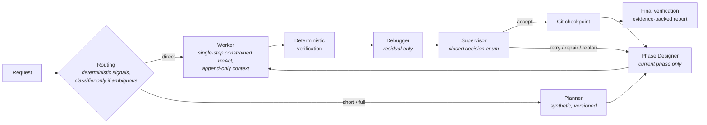

<div align="center">


**A verification-first agentic system that makes *tiny* local language models<br>reliably useful on non-prosumer hardware.**

[](memory/plan_red_giant.md)
[](pyproject.toml)
[](https://huggingface.co/unsloth/gemma-4-E2B-it-qat-GGUF)
[-555555)](docker/severino-sim/compose.yml)
[](#-target-hardware-severino)
[](#-key-technical-decisions)
[](LICENSE)

*The model stays small. The **system** becomes large.*

[Thesis](#-the-thesis) · [Niche](#-where-this-sits--the-niche-honestly) · [Decisions](#-key-technical-decisions) · [Findings](#-engineering-findings--measured-lessons-from-a-2b-local-agent) · [Pipeline](#-pipeline-at-a-glance) · [Hardware](#-target-hardware-severino) · [Roadmap](#%EF%B8%8F-roadmap--and-how-its-actually-going) · [Docs](#-repository-map) · [Quickstart](#-getting-started-development-windows)

</div>

---

Red Giant wraps a **~2B-effective-parameter model** — Gemma 4 E2B, Q4 QAT, GGUF, CPU-only — in a deterministic pipeline of **decomposition, continuous verification, minimal context, and KV-cache-aware prompt engineering**.

> Most agentic projects chase the biggest model they can reach. Red Giant goes the opposite way: the smallest usable model, on the kind of machine a non-prosumer actually owns — a 15W mini-PC with 4 CPU cores and no usable GPU. Anyone can build agents on a workstation-class GPU box; the interesting problem is closing the gap between local inference on consumer hardware and the inevitable scarcity of that scenario.

**Status:** early development — **the planner-system rebuild (S/M/J compiler behind deterministic gates) is built, piloted and officially measured**: a full vertical slice runs end-to-end on the CPU reference profile (plan → per-phase compilation → qualified tests → scoped junior execution → synthesis and coverage gates), ~50 permanent deterministic rules were distilled from ~130 instrumented runs, and the official A/B keeps it honest — **2/13 verified vs the naive baseline's 6/13**, with failures costing 44% fewer tokens and every ablated component proving its keep in failure containment (+51–76% cost without). Verdict: **still gated off by default**; it reopens after five identified control-plane fixes and a controlled thinking-mode experiment (both fully specified in the repo's plans). The earlier in-loop planner had already lost its own A/B (**2/10 vs 9/10**) and remains deprecated behind the same gate. Behind it, the Phase 2 single-process web GUI (async job queue, live execution tree, consent-based approvals with standing per-file grants, budget-extension prompts, guided relaunch of failed tasks) was live-tested through 3 rounds of user testing plus an automated 5-task battery: **15 defects found and fixed**, zero false claims in either direction. This README is refreshed at the end of every development phase.

## 🧠 The thesis

Small language models don't fail because they lack intelligence for a single step; they fail from *breadth*: tasks too wide, contexts too long, ambiguous instructions, unverified claims of success, errors compounding across steps. Red Giant doesn't try to make the model smarter — it systematically removes the conditions under which small models fail:

| # | Principle | In practice |
|---|---|---|
| 1 | **Global planning, local execution** | A synthetic, versioned plan; only the current phase is expanded; only one subtask runs at a time |
| 2 | **Continuous verification** | Deterministic oracles first (tests, compilers, linters, exit codes, citation matching); a model-based verifier only where no mechanical oracle exists. Subtasks are *designed* to be mechanically verifiable |
| 3 | **Minimal context** | Each role receives the least sufficient context (~4–8K tokens per call), never the full history |
| 4 | **Deterministic orchestration** | *The model proposes; the orchestrator decides.* Every state mutation is typed, attributed, persisted (SQLite). No success without recorded evidence |

## 🧭 Where this sits — the niche, honestly

The local-AI landscape splits into a few well-served categories, and Red Giant deliberately is none of them:

- **Agent orchestration frameworks** give you graphs, crews and tool-calling loops — but they implicitly assume a *capable* model (a cloud API or a large local one) that can recover from its own mistakes. Point them at a 2B model on a CPU and they spiral: the retry loops, verbose prompts and long contexts they rely on are exactly what small models and slow prefill cannot afford.
- **Local inference runners** solve *running* models on your hardware — quantization, serving, chat UIs. Essential plumbing (this project builds on one of them), but they stop where the hard problem starts: a served model is not a reliable agent.
- **Structured-output libraries** solve format validity via constrained decoding. Also essential, also a component: format-valid output can still be semantically empty, truncated, or confidently wrong — this project's field notes document exactly how.
- **Research on small-model agents** increasingly says the promising recipe is small models + strict specifications + external validators. Mostly papers and surveys; few end-to-end engineered systems exist, and fewer still target genuinely constrained hardware.

**Red Giant sits at an intersection few projects serve**: a complete, engineered agentic *system* — not a library — purpose-built for ~2B-parameter models on watt-constrained, CPU-only consumer hardware (a 15W mini-PC, 4 cores), where token economy, KV-cache reuse, deterministic verification and human consent are the architecture, not afterthoughts. Every design decision is documented with the measurement that justifies it, and every failure mode found in the field is recorded with its technical cause.

**What it is not, equally honestly:** not a drop-in framework you `pip install` around your own model (it is opinionated end-to-end); not validated beyond small synthetic repositories yet (the real-codebase exam is a planned phase); currently calibrated on one specific model and runtime build; and not an attempt to compete with big-model agents on capability — the bet is on raising the *floor* of what trivial hardware can do reliably, not the ceiling of what intelligence can do.

If you are trying to make a small local model do real, verified work on hardware you already own — this is the problem space this repository lives in, traps and all.

## ⚙️ Key technical decisions

| Decision | Rationale |
|---|---|
| 🐜 **Model: Gemma 4 E2B** (QAT, UD-Q4_K_XL GGUF) — the smallest, on purpose | Every measured improvement is attributable to the architecture, not model scale. E4B exists only as an evaluation reference |
| 📌 **Runtime: llama.cpp `llama-server`, version-pinned** (container digest = the reference) | Direct access to grammar-constrained decoding, KV-cache control (`cache_prompt`, slots, `--slot-save-path`), separate prefill/generation timings |
| 🔒 **Grammar-constrained decoding on every structured output** (JSON Schema → GBNF) | The sampler *cannot* produce malformed output: that failure class is eliminated by construction. Measured overhead: 0.4–10% |
| 🧩 **JSON-only runtime; one small Pydantic schema per role; closed enums** | A 2B model fills 8 constrained fields well and 40 free-text fields badly. Schemas double as the grammar contract |
| ♻️ **Stable prompt prefixes (S1→S7 layout), append-only agent loop** | llama.cpp reuses KV cache only for byte-identical prefixes. Prefill is the dominant cost on CPU — prefill engineering is a first-class goal of the project |
| 🚦 **Strictly sequential, batch-style execution; one inference at a time** | On 4 shared cores, concurrent inference is self-sabotage. Tasks are async jobs (launch, close the page, come back), not a chat |
| ⚖️ **Every cognitive role must earn its place** (A/B in a built-in evaluator) | Guards against governance overhead exceeding useful work. Guiding metric: **useful tokens / total tokens**. A role that doesn't pay for itself is removed |
| 📉 **Official metrics are CPU-only, on resource-capped profiles** | A dev GPU hides every token-economy problem. The reference profile is a Docker container capped to target-equivalent resources |
| 🚫 **No external LLM APIs, ever** | A system that escapes to a big model under pressure proves nothing. Honest explicit failure is a valid result |
| 🪶 **Stack: Python · FastAPI + HTMX + Jinja2 · SQLite · zero frontend build** | One process, one port, deployable as one container next to llama-server |

## 🔬 Engineering findings — measured lessons from a 2B local agent

This section records the engineering findings produced while building Red Giant. Most are **not claimed as novel principles in isolation**: several confirm established practice, but quantify its impact in an unusually constrained regime — a ~2B model, grammar-constrained JSON tool calls, CPU-only inference. Others document stack-specific failure modes or design patterns that emerged during implementation. Each finding states what was observed, the measured evidence, the countermeasure that now ships as working code, and how far the evidence reaches; findings may be revised, narrowed or retired as testing expands to other models, runtimes and real codebases. The **18 findings** below rest on **27 recorded observations** plus **~130 end-to-end pilot runs** of the planner-system rebuild (F15–F18, preliminary until the PS6 A/B lands) — the full set, each mapped to its file and technical cause, lives in the [codebase atlas §9](memory/codebase_reference.md), with raw reports in [`bench/results/`](bench/results/).

*Labels:* **measured confirmation** — known principle, quantified in this regime · **implementation finding** — behaviour that emerged building the system · **stack-specific** — tied to Gemma 4 E2B / the pinned llama.cpp build (the lesson may transfer; the numbers won't) · **engineering safeguard** — ordinary robustness, listed because its absence measurably hurt · **open hypothesis** — preliminary, awaiting larger-scale tests.

### 🔧 Tool design: how a small model edits files reliably

- **F1 — The edit interface must adapt to the model, not vice versa.** *(measured confirmation)* In the tested setup, unified diffs rejected logically correct fixes over a single blank-line context mismatch and looped; switching the worker to `old_string → new_string` replacement with a uniqueness requirement turned the same fix tasks from 20+ failing calls into 5–6 clean ones. The posture generalized: the model copies every representation artifact it sees — line-number prefixes pasted into edits and whole-file writes (prompt rules alone did not eliminate it), CRLF checkouts displayed as LF making every match impossible — so every write path normalizes both directions rather than legislating against the behaviour.
- **F2 — Tool failures must be state-aware and actionable.** *(engineering safeguard)* Ordinary robustness, listed because its absence measurably hurt: an edit that changes nothing (old = new) is an error, not a success — 15 identical no-op edits once ran to step-budget death as "successes"; a failed match returns the *closest matching region* of the file, turning multi-call not-found loops into one-round recoveries; a write that would break the file's syntax is rejected before touching disk, with the error line returned as data.

### 🔒 Constrained decoding: the grammar gives you shape, not meaning

- **F3 — The grammar constrains, but does not inform — and only within the token budget.** *(implementation finding)* With guided decoding active but the schema absent from the prompt, outputs were structurally valid JSON filled with literal placeholders (`"..."`, `"$id"`): 0/60 semantically usable, 60/60 once the schema was shown in the prompt, at 0.4–9.8% grammar overhead. Corollaries: output truncated at the token limit is broken JSON *despite* the grammar, so stop reason `limit` is an explicit error and per-role budgets are sized with headroom; and the instruction-tuned model needed its chat template even for raw structured completions *(stack-specific evidence)*.
- **F4 — Make incoherent output unrepresentable instead of validating it away.** *(implementation finding)* A raw `"` inside a JSON string *legally* closes it; when the schema offered an escape branch (a nullable required object), a derailed model took it, and one bad character became a 60-call loop. Discriminated unions removed the branch from the grammar itself — after a derail the model is forced back into a coherent step. Measured: 8/8 derail probes recovered structurally.

### 🧨 Failure modes of small models in agent loops

- **F5 — Small models invent identifiers under pressure; anchor them to the contract.** *(implementation finding)* Asked to plan around unseen code, the model named things by association (`slugify` where the tests import `slug`) and the invention propagated plan → code → failure. Countermeasure: **contract anchoring** — planning roles receive verbatim excerpts of the tests they must satisfy, and objectives are phrased by outcome, never by imagined API.
- **F6 — The prompt and the validator are one artifact.** *(implementation finding)* Deleting one sentence from a role prompt (*"verification entries must be exactly the known command ids"*) while the validator kept enforcing it killed 6 tasks out of 10 before a single tool call. In the tested regime the model executes exactly what it is told and cannot infer the missing half of a contract — every validator rule needs its sentence in the prompt, and official measurements run only from committed, tested code.
- **F7 — Determinism is per-backend, and without a fixed seed it does not exist at all.** *(stack-specific)* Unseeded, the server draws a random seed per request — pass/fail became a lottery across runs; with a fixed seed, CUDA and CPU builds still produced *different* trajectories. Reproducibility required pinning seed + backend + build together — a GPU dev pass is a hint, never a result.

### 🪙 Token economy on CPU-only inference

- **F8 — Planning governance must earn its keep; measured twice, it has not — but the *cost of failing* tells a different story.** *(measured, verdict standing)* The in-loop planner lost its A/B outright (**2/10 vs 9/10** for the naive baseline, 815K vs 710K tokens) and was gated off. Its redesigned successor — a plan *compiler* behind deterministic gates (S/M/J) — was then measured on a harder battery including three genuinely multi-session tasks: **2/13 vs 6/13**, with both arms at **0/3 on the wide tasks** — so it stays gated. What the rebuilt system *does* buy, measured: failures cost **44% fewer tokens** (636K vs 1,143K, equal wall time), useful-token share +9pt, and component ablations show each gate pays for itself in failure containment (removing oracle qualification, the task ledger, or the entry gate raises failure cost by **+51% / +76% / +50%** respectively). Three of the wide-task deaths traced to fixable control-plane defects, not model limits; the verdict reopens after those fixes plus a controlled thinking-mode experiment on the planning roles.
- **F9 — Token accounting must be explicit, compact and clamped.** *(engineering safeguard)* Compact JSON (no pretty-printing, in either direction) saved 20–30% of output tokens with no measured quality loss. And budget math must clamp against runtime cache reporting: the server can report more cached tokens than the prompt count, naive `prompt − cached` goes negative, and a summed budget silently *disables itself* — work is charged as `max(prompt − cached, 0) + generated` per call.

### ♻️ KV-cache reuse and prefill engineering

- **F10 — Prefix instability dominated agent-loop cost in the tested CPU setup.** *(measured confirmation — the strongest numbers in this repository)* Cold prefill on target-equivalent cores: 6.8s @ 1K → 30.7s @ 4K → 69.6s @ 8K → **173.6s @ 16K** of context; generation is memory-bound at 35.8 tok/s. Against that physics, call count alone predicted latency poorly: an 88-call append-only session incurred only **~82s of total prefill**, while changing one byte inside the shared prefix raised reprocessing from **65 to 7,971 tokens** (~120×). This supports treating prompt layout — stable prefixes, append-only agent loops — as part of the runtime architecture, not as prompt style.
- **F11 — Persistence claims must be measured, not trusted.** *(stack-specific)* KV-slot `save`/`restore` on the pinned llama.cpp build round-trips cleanly and returns ok — and then the very same prompt reprocesses 100% of its tokens, while ordinary `cache_prompt` reuse works perfectly. The feature is shelved; only the reuse counters tell the truth.

### 🎛️ Orchestration: running an unreliable proposer safely

- **F12 — The model proposes; deterministic code decides — and every model-driven loop needs an exit the model cannot veto.** *(engineering safeguard)* Plan and design *logic* (unique ids, acyclic dependencies, known commands, scoped verification) is validated in plain code, with exactly one corrective re-call — which must *cite the violated rule*, not just list symptoms, or the small model cannot fix it — then explicit failure. Every cap in this codebase (design rounds, replans, per-error counts, step budgets) exists because its absence produced a real infinite loop: a designer redesigning the same phase forever, 49 rewrites of one file, 15 identical no-ops. Caps are the price of running an unreliable proposer safely.

### ✅ Verification design: trusting an agent you cannot trust

- **F13 — Verification must be symmetric, scoped, and closed-world.** *(implementation finding)* Model claims are hypotheses in both directions: "answer written to file" with no write call in the session fails, and "I am blocked" with green tests succeeds — objective checks override self-reports both ways, with mismatches downgraded to warnings. Closed-world: a verification step naming an unknown command FAILS the subtask instead of being skipped, or a typo becomes a false pass. And scope must coincide with verification: a subtask judged by tests it was forbidden to fix rewrote the one file it could touch **49 times**; the full suite now belongs only to the subtask that owns the final state — accepting, and recording as a cost, that intermediate errors then surface later.

### 🤝 Consent UX: humans in the loop without losing the cache

- **F14 — Consent must have memory, failure must be a dialogue, and pauses must not cost prefill.** *(implementation finding)* Per-call write approval produced real user revolt ("1000 approvals… like filing taxes"): one approval now grants a standing, revocable permission for that (action-family, file) pair, with `no` remembered exactly as long as `yes`. Budget exhaustion *asks* for an extension instead of killing the task, and failed tasks surface their reasons and offer a guided relaunch. And because on CPU every human pause once meant a cold restart of the work, the volatile context is saved at the block and resumed *in-place* with a warm KV cache — removing most of the avoidable prefill cost of having a human in the loop.

### 🧭 Planner rebuild (S/M/J): reference coherence is the control plane's job

- **F15 — The model creates the meaning; the control plane creates the identity.** *(implementation finding — the central lesson of the planner rebuild)* A 2B model calls the same thing by three names, orders dependent steps upside down, and imports modules that do not exist yet. Every time an *identity* decision was moved from the model into deterministic code — canonical obligation/test naming (`P1.S1.O1 → test_p1_s1.py::test_p1_s1_o1`), topological ordering of micro-phases, ownership dedup and auto-split, resolvable-import checks, contract prose confined to the micro's own file perimeter — the corresponding failure family went to **zero**, not merely down: invented file names 6/20 → 0 after existing-file grammar enums; planner↔test-author name mismatches 11/20 → 0 after canonical naming; oracle-fooling tests 5/20 → 0 the batch after the top-level-import rule. ~45 permanent deterministic rules were distilled this way from ~130 end-to-end runs.
- **F16 — A test's power to fail is checkable before trusting the test.** *(implementation finding)* Model-written tests cheated in every way a validator did not forbid: tautological asserts, `__dict__`/`__annotations__` introspection instead of behaviour, string-literal mentions of the target instead of calls, imports of the module under test wrapped in `try/except` so the file stays green while the module is missing. The oracle qualification gate now *executes* each test's claim to discriminate (red baseline on missing behaviour, green on existing) and AST checks reject the cheat patterns statically — so a weak oracle dies in the repair loop, where a patch costs hundreds of tokens, not at the end of the task, where it costs everything.
- **F17 — A fixed seed is not determinism on GPU; and determinism is a prompt property first.** *(stack-specific)* Runtime task artifacts (logs, plan documents with per-run ULID names) leaking into repo listings silently varied every prompt, making the fixed seed irrelevant — prompt-level determinism had to be engineered before seed-level determinism meant anything. After prompts were made bit-identical, CUDA continuous batching *still* produced divergent trajectories run-to-run. Consequence: GPU batches are used to classify failure families, never to compare fine success rates (2↔7 greens out of 20 on identical code is mostly noise); comparable numbers come only from the pinned CPU profile.
- **F18 — With references made coherent, the residual walls are capability walls — now visible, attributable, and split by role.** *(measured in the official A/B)* On the GPU iteration batches the dominant residual was the junior failing exact output formats even when shown the test source and the failing assertion diff. The official CPU A/B then exposed the upstream twin: the **planner under-scoping requests** (a plan covering one third of the ask, internally coherent, honestly "completed" — and externally wrong: the one completed≠verified gap in 62 official runs) and the mid-roles writing wrong characterizations that the oracle gate correctly kills at compile time. Every death now has a stage, a cause and a cost; the cheap next lever is explicit reasoning for the *deciding* roles (planner and phase compiler), which is exactly what the queued thinking-mode experiment measures — a stronger model dropped into the same scaffold inherits the entire discipline for free.

Every countermeasure above ships as working code in this repository; the [codebase atlas §9](memory/codebase_reference.md) maps each of the 27 underlying observations to its exact file, signature and technical cause (the F15–F18 observations join the atlas at PS5 closure).

**Measured baselines** on the capped reference profile (2 workstation cores ≈ 4 target cores, [full report](bench/results/f0_baseline_severino-sim.md)):

| Metric | Value |
|---|---|
| Cold prefill @ 1K / 4K / 8K / 16K ctx | 6.8s / 30.7s / 69.6s / **173.6s** — why small contexts are a design constraint, not a preference |
| Generation | 35.8 tok/s (memory-bound: 24 threads only reach 42) |
| Prefix reuse (8K ctx) | append-only: **65** tokens reprocessed · one byte changed mid-prompt: **7,971** (~120× worse) |
| Grammar overhead | 0.4–9.8% on generation speed |

## 🔁 Pipeline at a glance



**Domains:** coding (verified by tests) · local research & web research (verified by mechanical citation checking and multi-source triangulation) · advice (explicit, logged choice between web-first and declared model-knowledge). *Not a coding assistant* — the same pipeline serves all four.

## 🖥️ Target hardware ("Severino")

| | |
|---|---|
| **Machine** | BOSGAME E5 mini-PC home server |
| **CPU** | AMD Ryzen 3 5300U (Zen 2, 4C/8T, 15W) — **4 cores allocated** to Red Giant + llama-server |
| **GPU** | none usable (iGPU Vega: no ROCm, Vulkan marginal) → **CPU-only inference** |
| **RAM** | 32 GB dual-channel (at MVP time), ~10 GB budget |
| **Constraint** | the rest of a full homelab stack keeps running on the same box |

Development happens on a fast workstation, but **official numbers only come from CPU-capped profiles** (`severino-sim`: Docker, 2 workstation cores ≈ 4 target cores, 10 GB) and from the real box.

## 🗺️ Roadmap — and how it's actually going

This is the project's state of the union: for every phase, how it went, what
we learned, what's still owed. It is a *summary* — every phase, trap and test
mentioned here lives in full detail in its own document:

- 📐 [`plan_red_giant.md`](memory/plan_red_giant.md) — every phase with sub-phases, rationale, acceptance criteria and per-phase outcome blocks ("ESITO F*n*");
- 🗺️ [`codebase_reference.md`](memory/codebase_reference.md) — §9 lists **every trap** with its technical cause, §10 the open debt with its destination phase, §7 the test catalog;
- 📊 [`bench/results/`](bench/results/) — the committed measurement reports behind every number quoted below.

### ✅ F0 — Foundations (`v1.1.0`)

*Goal: pin the runtime, verify the model, measure the hardware — before writing any pipeline code.*

- **How it went:** everything shipped, but probing the model produced three surprises that shaped the whole project. In short: forcing the output format (the "grammar") guarantees *shape*, not *content* — the model must also *see* the schema, must have enough token budget, and must use its chat template, or it produces well-formed nonsense.
- **Key number:** on target-equivalent cores, reading a 16K-token context takes **3 minutes**. Small contexts are physics, not taste.
- **Owed:** KV slot persistence is broken on the pinned llama.cpp build — re-check in F5.

### ✅ F1 — Deterministic core + worker (`v2.0.0`)

*Goal: a walking skeleton that solves real (tiny) coding tasks, and becomes the control group every future "smart" role must beat.*

- **How it went:** 4 of 6 synthetic tasks solved and externally verified on the capped profile; zero false success claims.
- **What we learned** (the lesson that defines the project): in almost every failure the model had *reasoned correctly* — the environment was lying to it. Unified diffs punished correct fixes over a blank line; file reads showed line numbers the model then faithfully copied into its edits. **Adapt the environment, don't fight the model** — e.g. switching from diffs to exact-string replacement turned 20-call failures into 5-call successes.
- **Owed:** one task fails on pure reasoning (the model can't flip "that file is off-limits, so the bug must be in the caller") — it waits for the Supervisor (F4).

### ✅ F2 — Web GUI (`v2.1.0`)

*Goal: an interface comfortable enough that the user actually tests the system — before the pipeline gets complex.*

- **How it went:** the hardest shakedown so far. Three rounds of live user testing plus an automated battery found **15 defects**. The most instructive: a single unescaped quote inside a JSON string derails a small model into a 60-call chaos loop — fixed *structurally*, by making the incoherent output branch impossible to generate (discriminated unions).
- **What matured here:** the consent model. Approving a write grants that file for the whole task (revocable); running out of budget *asks you* instead of killing the task; approval requests show a readable diff of what would be written; after your approval the task resumes exactly where it stopped, with the cache still warm.
- **A principle worth stealing:** verification is symmetric — if the tests are green, the work is done even when the model *believes* it failed. Claims never beat oracles, in either direction.
- **Owed:** everything is proven on 2-4 file toy repos; several tolerances are calibrated on this exact model and build.

### ✅ F3 — Planning (`v3.0.0`) — shipped, measured, and demoted by its own A/B

*Goal: a Planner that maps the work into phases, expanded lazily, with replanning when reality disagrees.*

- **How it went:** everything was built and works mechanically — plan generation, deterministic logic validation with rule-citing corrective re-calls, lazy expansion, bounded replanning. Along the way: a planner that hasn't *seen* the tests invents function names the tests then reject (fixed with contract anchoring), and a subtask judged by tests it's forbidden to fix thrashes forever — 49 rewrites of one 5-line file (fixed with scoped verification). A first A/B run had to be invalidated: it ran from an uncommitted working tree where one deleted prompt sentence killed 6 tasks out of 10 — two permanent method rules came out of that (prompt and validator are one artifact; official runs only from committed code).
- **The honest verdict:** the official A/B was brutal — **2/10 verified vs the baseline's 9/10**, at higher token cost (815K vs 710K). On micro-tasks planning is not just overhead but a regression: redundant phases duplicated finished work, artificial "analysis" subtasks demanded artifacts nobody needed, and failed subtasks were retried verbatim. Per the project's own rule (every role earns its place or leaves), the planner is now **off by default behind a config gate** — tasks get the deterministic naive plan that won the A/B, at zero planning tokens.
- **What the failure taught:** the thrashing was the *gates'* fault, not the proposer's — nothing checked whether a phase was already satisfied, whether a retry differed from the failed attempt, whether a new plan differed from the failed one. That diagnosis reshaped the design.
- **Owed:** the planning system is being rebuilt as a standalone effort with its own plan — the planner as a plan-document *author* that writes once and exits, deterministic zero-token gates (phase-entry, retry-must-differ, replan-must-differ), a task ledger as external memory. *When* to plan stays F6's routing question; the final word belongs to the real codebase (F8).

### ⏭️ Next

- **⏸️ Interlude (current): the planner-system redesign** — the main roadmap is paused while the planning system is rebuilt and A/B-ed as a standalone system (dedicated plan in `memory/`); the roadmap resumes at F3-bis when it earns its way back in.
- **F3-bis — Multi-domain micro-slice** *(user-requested)*: prove the engine on everyday non-coding work — local document analysis, external API calls (never LLM APIs), document transforms — before designing the Supervisor, so F4 knows non-coding failure modes too.
- **F4 — Continuous verification**: debugger, supervisor, anti-loop, git checkpoints. Two customers already waiting: the reasoning-trap task and a human protocol that evolves from answering machine to dialogue.
- **F5 — Context & KV-cache engineering**: the cache already proved itself (88 calls cost only 82s of prefill on CPU); F5 makes it measured and engineered, and re-checks slot persistence.
- **F6 — Adaptive routing**: small tasks go straight to the worker, big ones through the planner — where the "when is planning worth it" question gets its answer, and model-specific tolerances get A/B-ed as a system.
- **F7 — Non-coding domains in full**: web search, verified citations, multi-source triangulation, advice with declared provenance.
- **F8 — The real exam**: a Laravel 13 chatbot codebase on the target box — final numbers for the planner, the tolerances, and the whole thesis.

## 📚 Repository map

| Document | Purpose |
|---|---|
| [`memory/small-model-powerhouse-specsheet.md`](memory/small-model-powerhouse-specsheet.md) | Vision & requirements (the operating spec) |
| [`memory/plan_red_giant.md`](memory/plan_red_giant.md) | The implementation **contract**: 21 binding decisions, full architecture (DB DDL, config, tool catalog, prompt layout), 9 phases with real signatures, per-subphase rationale and acceptance criteria. Self-sufficient by design |
| [`memory/codebase_reference.md`](memory/codebase_reference.md) | The codebase atlas — every real class/signature/table/endpoint, mechanically verified against the code by `scripts/check_reference.py` (build-blocking) |
| [`bench/results/`](bench/results/) | Committed measurement reports (constrained-decoding probe, CPU baselines) |

## 🚀 Getting started (development, Windows)

```powershell
py -3.12 -m venv .venv
.venv\Scripts\Activate.ps1
pip install -e ".[dev]"

scripts\download-llama.ps1     # pinned llama.cpp binaries (CUDA + CPU)
scripts\download-model.ps1     # Gemma 4 E2B QAT Q4 GGUF, SHA256-verified
scripts\start-llama.ps1 -Profile dev-fast                 # CPU-bound dev server (24 threads
                                                          # — the GPU is deliberately unused)
docker compose -f docker\severino-sim\compose.yml up -d   # the honest 2-core profile

python bench\schemas_probe.py --url http://127.0.0.1:8080   # constrained-decoding probe
python bench\run_bench.py --profile severino-sim            # CPU baseline
python scripts\check_reference.py                           # atlas ↔ code verification
```

---

<div align="center">
<sub>

Licensed under the [MIT License](LICENSE) — free to use, modify and redistribute, **provided the Red Giant attribution notice is preserved**.

**Topics:** small language models · SLM agents · local LLM · Gemma 4 E2B · llama.cpp · GGUF · grammar-constrained decoding · JSON Schema · GBNF · KV cache reuse · prefill optimization · CPU-only inference · agentic pipeline · deterministic orchestration · verification-first · home server · self-hosted AI

</sub>
</div>
